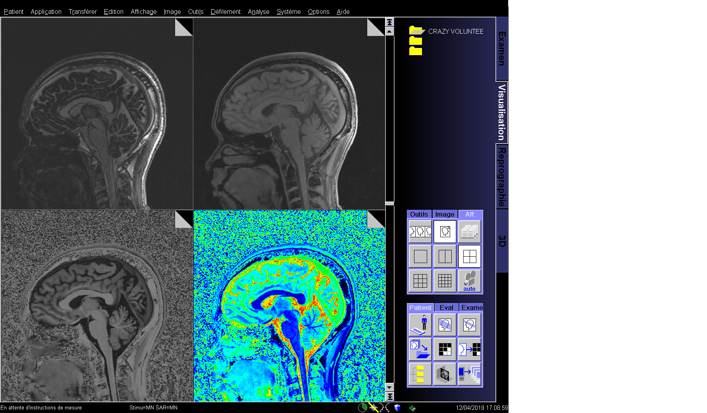

# Lecture 3 : Basic reconstruction using Python (2/3)

Title : Basic reconstruction using Python

Schedule : June 11, 2020 | 15:40-17:00 

Speaker: Valéry Ozenne

## Summary

 - [Foreword](#foreword)
 - [A brief description of the class used to store readout, kspace or image data](#a-brief-description-of-the-class-used-to-store-readout-kspace-or-image-data)
    - [Readout](#readout)
    - [Kspace](#kspace)
    - [Image](#image)
 - [My First Data Buffered Gadget](#my-first-data-buffered-gadget)
    - [Writing the Buffered Gadget](#writing-the-buffered-gadget)
    - [Writing the XML](#les-issues)
    - [Compilation](#faq)
    - [Reconstruction and visualisation](#reconstruction-and-visualisation)
    - [Exercice 1: Fourier Transform using ismrmrd-python-tool](#exercice-1-fourier-transform-using-ismrmrd-python-tool)
    - [Exercice 2: Fourier Transform using SigPy](#exercice-2-fourier-transform-using-sigpy)
    - [Exercice 3: Fourier Transform using BART](#exercice-3-fourier-transform-using-bart)
    - [Exercice 4: Grappa reconstruction using PyGrappa](#exercice-4-grappa-reconstruction-using-pygrappa)


## Foreword

Gadgetron is really powerfull for in-line prototyping and clinical integration. Gadgetron included many toolboxes (that will be presented in C++ lectures) with operators (partialDerivativeOperator, laplaceOperator, encodingOperatorContainer), linear solver (Conjugate Gradient, ...), non-linear solver (Split Bregman Solver, ...). Implementation on CPU and GPU are available and offer good/excellent performance. Such tools are common to solve the inverse problem, but the C++ implementation can be long and scary at first try... Popular libraires are avaible in other language and can be easily incorporated into the gadgetron chain. The objectives of the second part is to present how to integrate MRI libraries for compressed sensing, into the reconstruction chain. 

As an example below, a CS MP2RAGE with acceleration of 2.8 along Y and Z (~8 in total) was reconstructed in-line using the Gadgetron and BART and send back to the console of a 3T Prisma from Siemens. The figure displays echo 1 (top left), echo2 (top right), the mp2rage (bottom left) and the t1 map (bottom right). Images are then automatically stored on the PACS as usual. T1 map volume was generated from the Gadgetron and also send back to the scanner and tagged as a T1 map from the Siemens side. Then you can start discussing with your collegues and clinicians which colormap matchs the most for the rendering... The slides, presented at the ISMRM 2019 during the Open-Source Software Tools sessions, are available at this link [Gadgetron Bart T1 demo](https://github.com/NHLBI-MR/ISMRM2019_demo/tree/master/Gadgetron_Bart_T1_demo). 



## A brief description of the class used to store readout, kspace or image data

The data structures in the Gadgetron vary during reconstruction. It is important to differenciate, the class or common structures 

* used to store a unit of readout that would feed into a buffer
* used to store a unit of data that would feed into a reconstruction
* used to store an array of reconstructed data

Each of them are defined in a C++ and have equivalent in Python. Additionnal structure are also present and you can create new one

### Readout

In C++ , the python gadget will receive two messages which contain the **AcquisitionHeader** and the data in a matrix **hoNDArray< std::complex<float> >**.
In Python, as presented before, we receive a structure including both the data in a **ndarray** from numpy and the fields from the **AcquisitionHeader**

``` 
for acquisition in connection:
   print(acquisition.scan_counter)
   print(np.shape(acquisition.data))
```

### Kspace

In cartesian sampling, two gadgets play a fundamental role : AcquisitionAccumulateTriggerGadget and BucketToBufferGadget. 

These gadgets are used to buffer readouts in order to build the kspace. In MRI, the dimensions are very numerous:: 

* kx (RO)
* ky (E1)
* kz (E2)
* channels (CHA)
* average
* repetition
* segment
* contrast
* phase
* set
* slice (SLC)
* ...
 
By convention, in input the matrix size is [RO, CHA] and in output is [RO, E1, E2, CHA, N, S, SLC].
The dimensions **N** and **S** are chosen by the user. 

It is very interesting to put your stuff after these gadgets. The kspace data are automatically sorted, whether it is the calibration lines in parallel imaging or the lines sampled, in presence of partial fourier, the lines are correctly positionned. Lot's things are automatically settle by the Gadgetron.  

The calibration data if present is accessible via the following structure:

```
buffer.ref.data  
buffer.ref.header
```

The fullysampled or undersampled data are accessible via the following structure:

```
buffer.data.data
buffer.data.header
```

Be cautious, the size of the headers is associated with the size of the data. Between them the headers are generally different, for example the position of the slicess change according to the SLC direction. We now have a hoNDarray acquisitionHeader with a matrix size of [E1, E2, N, S, SLC]. The headers being identical according to the direction of readout and for all channels.

 
### Image

TODO

## My First Data Buffered Gadget

### Writing the Buffered Gadget

Create the file `my_first_buffered_data_gadget.py`  then copy the following function. You can call it `SimpleDataBufferedPythonGadget`

```
import numpy as np
import gadgetron
import ismrmrd
import logging
import time

def SimpleDataBufferedPythonGadget(connection):
   logging.info("Python reconstruction running - reading readout data")
   start = time.time()
   counter=0

   for acquisition in connection:          
        
      
       connection.send(acquisition)

   logging.info(f"Python reconstruction done. Duration: {(time.time() - start):.2f} s")
```

### Writing the XML

We will now create a new xml file named `external_python_buffer_tutorial.xml`

```xml
<?xml version="1.0" encoding="UTF-8"?>
<configuration>
    <version>2</version>

    <readers>
        <reader>
            <dll>gadgetron_core_readers</dll>
            <classname>AcquisitionReader</classname>
        </reader>
        <reader>
            <dll>gadgetron_core_readers</dll>
            <classname>WaveformReader</classname>
        </reader>
    </readers>

    <writers>
        <writer>
            <dll>gadgetron_core_writers</dll>
            <classname>ImageWriter</classname>
        </writer>
    </writers>

    <stream> 

       <gadget>
            <dll>gadgetron_mricore</dll>
            <classname>NoiseAdjustGadget</classname>
        </gadget>
        
          <!-- EPI correction -->
     <gadget>
        <name>ReconX</name>
        <dll>gadgetron_epi</dll>
        <classname>EPIReconXGadget</classname>
     </gadget>

     <gadget>
        <name>EPICorr</name>
        <dll>gadgetron_epi</dll>
        <classname>EPICorrGadget</classname>
     </gadget>

     <gadget>
        <name>FFTX</name>
        <dll>gadgetron_epi</dll>
        <classname>FFTXGadget</classname>
     </gadget>

     <gadget>
        <name>OneEncodingSpace</name>
        <dll>gadgetron_epi</dll>
        <classname>OneEncodingGadget</classname>
      </gadget>


       <!-- Data accumulation and trigger gadget -->
    <gadget>
        <name>AccTrig</name>
        <dll>gadgetron_mricore</dll>
        <classname>AcquisitionAccumulateTriggerGadget</classname>
        <property><name>trigger_dimension</name><value>repetition</value></property>
        <property><name>sorting_dimension</name><value></value></property>
    </gadget>

      <gadget>
        <name>BucketToBuffer</name>
        <dll>gadgetron_mricore</dll>
        <classname>BucketToBufferGadget</classname>
        <property><name>N_dimension</name><value>contrast</value></property>
        <property><name>S_dimension</name><value>average</value></property>
        <property><name>split_slices</name><value>false</value></property>
        <property><name>ignore_segment</name><value>true</value></property>
     </gadget>

        <external>
            <execute name="my_first_buffered_data_gadget" target="SimpleDataBufferedPythonGadget" type="python"/>
            <configuration/>
        </external>
 
    </stream>

</configuration>
```

### Compilation 

Nothing to do.

### Reconstruction and visualisation

To run the reconstruction chain, you'll need to run Gadgetron, and the Gadgetron ISMRMRD client in two different terminal located in the same folder.

Start Gadgetron:
```bash
$ gadgetron
```

Run the ISMRMRD client: 
```bash 
$ gadgetron_ismrmrd_client -f Data/meas_MID00026_FID49092_cmrr_12s_80p_MB0_GP0.h5  -C external_python_tutorial.xml
```

You will see from the Gadgetron ISMRMRD client side :

``` bash
Gadgetron ISMRMRD client
  -- host            :      localhost
  -- port            :      9002
  -- hdf5 file  in   :      /home/valery/DICOM/2017-09-14_IBIO/meas_MID00026_FID49092_cmrr_12s_80p_MB0_GP0.h5
  -- hdf5 group in   :      /dataset
  -- conf            :      default.xml
  -- loop            :      1
  -- hdf5 file out   :      out.h5
  -- hdf5 group out  :      2020-05-19 15:44:55
This measurement has dependent measurements
  Noise : 16
Querying the Gadgetron instance for the dependent measurement: 66056_63650129_63650134_16
```


You will see from the Gadgetron server side :

```bash
[...]

```

### Exercice 1: Fourier Transform using ismrmrd-python-tool


```python
import matplotlib.pyplot as plt
from ismrmrdtools import show, transform
```

```python
for acquisition in connection:
      
       #acquisition is a vector of a specific structure, we called reconBit 
       #print(type(acquisition[0]))

       for reconBit in acquisition:

           print(type(reconBit))
           # reconBit.ref is the calibration for parallel imaging
           # reconBit.data is the undersampled dataset
           print('-----------------------')
	   # each of them include a specific header and the kspace data
           print(type(reconBit.data.headers))
           print(type(reconBit.data.data))

           print(reconBit.data.headers.shape)
           print(reconBit.data.data.shape)
           
           repetition=reconBit.data.headers.flat[34].idx.repetition 
           print(repetition)
```

we could set alternative names for acquisition and reconBit but data, ref and data and headers are fixed and refered to a specific class.

```python
for lala in connection
  for lili in lala
      #use
      lili.ref.headers
      lili.ref.data
      lili.data.headers
      lili.data.data
      
```

Now, let's do the 2D IFFT using the transform function from ismrmrdtools. It is calling numpy.ifft and numpy.iff_shift.

```
im = transform.transform_kspace_to_image(reconBit.data.data, [0,1])
```

Let's plot the result at each repetition for channel 0 and slice 0

```
plt.subplot(121)
plt.imshow(np.abs(np.squeeze(reconBit.data.data[:,:,0,0,0,0,0])))
plt.subplot(122)
plt.imshow(np.abs(np.squeeze(im[:,:,0,0,0,0,0])))
```


 
### Exercice 2: Fourier Transform using Sigpy

"SigPy is a package for signal processing, with emphasis on iterative methods. It is built to operate directly on NumPy arrays on CPU and CuPy arrays on GPU. SigPy also provides several domain-specific submodules: sigpy.plot for multi-dimensional array plotting, sigpy.mri for MRI iterative reconstruction, and sigpy.learn for dictionary learning." (extract from [sigpy.readthedocs](https://sigpy.readthedocs.io/en/latest/)

Sigpy offer an elegant way of solving the inverse problem in MRI reconstruction. The code is as close as possible to the mathematical formula. You pick a formula and some data, built the oeprators and chose a regulation and that's it. Some examples are available here [link](https://github.com/mikgroup/sigpy-mri-tutorial/):  

Here, we will just perfomed the inverse fourier transform by calling the adjoint of the FFT operator (<a href="https://www.codecogs.com/eqnedit.php?latex=F^{-1}" target="_blank"></a>)

In the following example, even if it is not necessary, a loop over the last dimension (N,S,SLC) is performed to apply the ifft only on a 4D array [RO, E1, E2, CHA].
Be careful, the input of SigPy is starting with the channel but I'm not sure if I should input by convention [CHA,RO,E1,E2] or [CHA, E2, E1, RO].  In the following case, I used [CHA, E2, E1, RO]  on a 2D dataset, so the FFT operator apply only on the last two dimensions. Anyway, np.transpose is therefore usefull twice.


```python
#SigPy import
import sigpy as sp
import sigpy.mri as mr
import sigpy.plot as pl
```

In order to do a simple fft, add the following lines

```python
dims=reconBit.data.data.shape
im=np.zeros(dims, reconBit.data.data.dtype)
for slc in range(0, dims[6]):
  for s in range(0, dims[5]):
      for n in range(0, dims[4]):
          kspace=reconBit.data.data[:,:,:,:,n,s,slc]
          # tranpose from [RO E1 E2 CHA] to [CHA E2 E1 RO]
          ksp=np.transpose(kspace, (3, 2 , 1, 0))                    
          print(ksp.shape)
          # definition of the FFT operator only on the last two dimensions.
          F = sp.linop.FFT(ksp.shape, axes=(-1, -2))
          # F.H is the inverse of F 
          I=F.H * ksp
          #  
          im[:,:,:,:,n,s,slc]=np.transpose(I, (3, 2 , 1, 0))

```


### Exercice 3: Fourier Transform using BART

The Berkeley Advanced Reconstruction Toolbox (BART) toolbox is a free and open-source image-reconstruction framework for Computational Magnetic Resonance Imaging developed by the research groups of Martin Uecker (Göttingen University), Jon Tamir (UT Austin), and Michael Lustig (UC Berkeley). It consists of a programming library and a toolbox of command-line programs. The library provides common operations on multi-dimensional arrays, Fourier and wavelet transforms, as well as generic implementations of iterative optimization algorithms. The command-line tools provide direct access to basic operations on multi-dimensional arrays as well as efficient implementations of many calibration and reconstruction algorithms for parallel imaging and compressed sensing. (extract from [mrirecon.github.io](https://mrirecon.github.io/bart/)

BART is easy to use, pics is magic, and tutorial are available here [bart-workshop](https://github.com/mrirecon/bart-workshop)

Don't forget to add the following lines in our ~/.bashrc

```bash
export BART_DIR=/home/valery/Dev/bart
export TOOLBOX_PATH=${BART_DIR}
export PATH=${TOOLBOX_PATH}:${PATH}

```


```python
#BART import
import os
import sys
path = os.environ["TOOLBOX_PATH"] + "/python/";
sys.path.append(path);
from bart import bart
import cfl
```

In order to do a simple fft, add the following lines

```python
try:
   print("calling BART")              
   im=bart(1, 'fft -iu 7',  reconBit.data.data)
except:
   print("issue with BART")

```


### Exercice 4: Grappa reconstruction using PyGrappa

"GRAPPA is a popular parallel imaging reconstruction algorithm. Unfortunately there aren’t a lot of easy to use Python implementations of it or its many variants available, so I decided to release this simple package.

There are also a couple reference SENSE-like implementations that have made their way into the package. This is to be expected – a lot of later parallel imaging algorithms have hints of both GRAPPA- and SENSE-like inspirations." (extract from [pygrappa.readthedocs](https://pygrappa.readthedocs.io/en/latest/)

The sequence play the ACS in separate mode in other word the ACS are played only once at the first repetition.
We need to do the calibration once and to buffer the result and apply them for each incomping undersampled kspace at each repetition.
The calibration is stored for each N,S,SLC, dimensions using a loop  


```python
#pygrappa import
from pygrappa import grappa
```

we must catch the reference data or ACS calibration using the following line
```
reference=[] # outside the loop

try: 
   if reconBit.ref.data is not None:
     print("reference data exist")            
     np.save('/tmp/gadgetron/reference', reconBit.ref.data)
     reference=reconBit.ref.data
   else:
     print("reference data not exist")
except:
     print("issue the reference data, this normal if the repetition number is higher than 0")
      
```


```
# size of the undersampled dataset
dims=reconBit.data.data.shape
# the reco is done on a 3D dataset [RO,E1,CHA], some loops are necessary 
# to catch and put back the data after the reco
kspace_data_tmp=np.zeros(dims, reconBit.data.data.dtype)
for slc in range(0, dims[6]):
     for n in range(0, dims[5]):
         for s in range(0, dims[4]):
        
             kspace=reconBit.data.data[:,:,:,:,s,n,slc]
             calib=reference[:,:,:,:,s,n,slc]        
                
             calib=np.squeeze(calib,axis=2)
             kspace=np.squeeze(kspace,axis=2)
               
             sx, sy,  ncoils = kspace.shape[:]
             cx, cy,  ncoils = calib.shape[:]

             # Here's the actual reconstruction
             res = grappa(kspace, calib, kernel_size=(5, 5), coil_axis=-1)

             # Here's the resulting shape of the reconstruction.  The coil
             # axis will end up in the same place you provided it in
             sx, sy, ncoils = res.shape[:]                
             kspace_data_tmp[:,:,0,:,s,n,slc]=res

        
# ifft, this is necessary for the next gadget in the standard cartesian chain     
im = transform.transform_kspace_to_image(kspace_data_tmp,dim=(0,1,2))
```

## Second conclusion

This conclude the lecture on kspace. Before sending the data to the MRI. You need to fill some fields in ImageHeader, that are not currently working in Python.
Such field are really important at the scanner side to load correctly the volumes, to send back multiple volumes from a single acquisition, and to set them as a specific role like T1_map as in the example. Complete integration of you reco with Siemens post-processing tools can be achieved leading to a fully transparent reco from user perspective.
You can also tag the data as a GT reco for the history !
 

