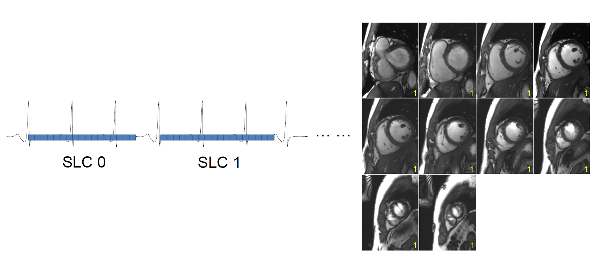

## Generic chain in Gadgetron

Gadgetron framework is very powerful and flexible. Yet, it is necessary to provide a more unformed implementation for most common reconstruction tasks. The motivation to provide a generic recon scheme in Gadgetron includes: 1) provide default implementation for reconstruction components; 2) enabel users to overload these components to their needs; 3) support on-the-fly reconstruction; and 4) demo and tutorial purpose.

The key idea behind generic recon chain is the on-the-fly recon concept: reconstruction should start while enough data is aviable, instead of waiting to the end of a scan. To enable flexible on-the-fly recon, a triggerin scheme was implemented. User can specify which dimension the recon will be triggered on. For example, for a cardiac cine imaging, if the trigger_dimension is slice, the recon for slc=0 will start after all data for this slice was acquired. For the multi-slice acquisition, this scheme can reduce user waiting time by an order of mangnitude. 



This couse reveals the motivation and design of generic chain and go through all key gadgets for their functionalities. The key data structures are introduced. 

Please download the test data [here](https://gadgetrondata.blob.core.windows.net/open-shared-datasets/rt_cine_test_2slice.h5), To run the example realtime CMR cine imaging data:

```
gadgetron_ismrmrd_client -f rt_cine_test_2slice.h5 -c Generic_Cartesian_Grappa_RealTimeCine.xml -a host_ip -p host_port
```