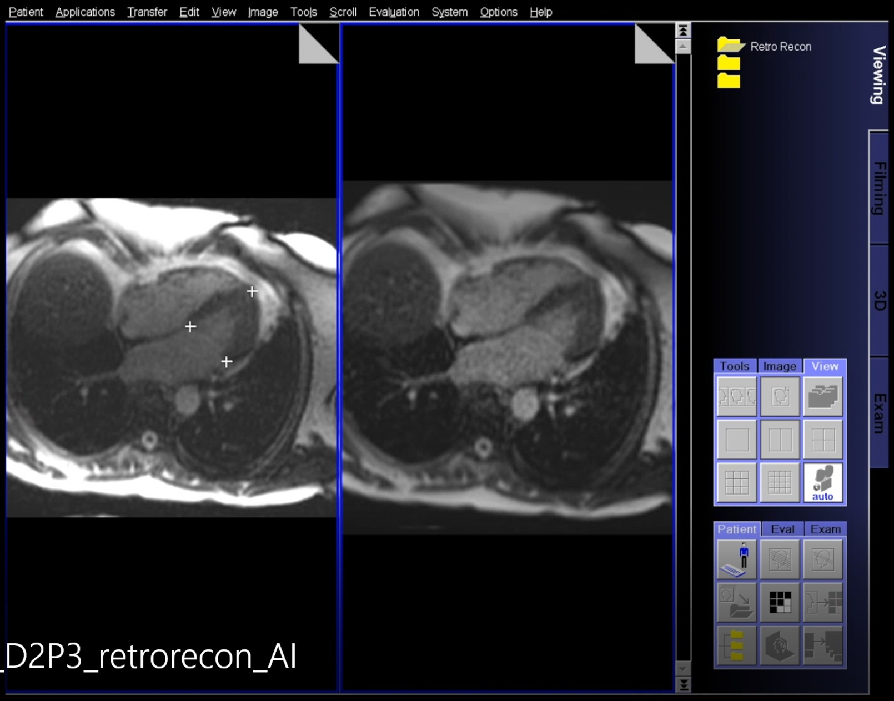

## Call AI in Gadgetron

While AI is very significant on consumer market with countless applications, its adoption in medical imaging devices and related clinical imaging workflow is rather slow. To help build up AI MR imaging applications, Gadgetron was extended with ability to call or train AI models and apply models to incoming kspace and imaging data. This feature was called [InlineAI](http://archive.ismrm.org/2019/4837.html).

Please ref to the slides for explanation of call AI models.

These demo examples are on the master branch. 

To run the two demo examples:

### Grappa AI

This is a demonstration example to implement Grappa reconstruction using Pytorch and call it inline via the Gadgetron generic chain. This demo is an example of inline training AI model, which means pre-trained model was not provided, rather the training was performed on incoming data. This may not be the most typical use case of supervised learning, but can be useful for tasks like MR reconstruction.

### Inline Cardiac MR landmark detection

This is a typical supervised learning example where user did the pre-training outside Gadgetron and supplied a pre-trained model. Gadgetron allows user to write python functions to load the model and apply it on incoming images. In this example, a model was pre-trained to detect key landmark points in long-axis CMR cine images. The resulting detected key points was plotted on images and send back to scanner.

The tested data can be downloaded [here](https://gadgetrondata.blob.core.windows.net/open-shared-datasets/2ch_RT_cine.h5). The pre-trained model can be downloaded [here](https://gadgetrondata.blob.core.windows.net/open-shared-datasets/CMR_landmark_network_RO_352_E1_352_ch2_ch3_ch4_myo_pts_with_T1_LGE_LossMultiSoftProb_KLD_Dice_Pytorch_1.5.0_2020-06-17_20200617_111642.pts). These data and model are for research usage only.

The model was trained in [Pytorch 1.5.0](https://pytorch.org/). The default path for Gadgetron to load model is ${CMAKE_INSTALL_PREFIX}/local/share/gadgetron/python .

